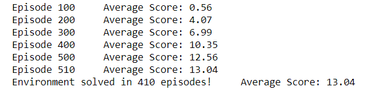
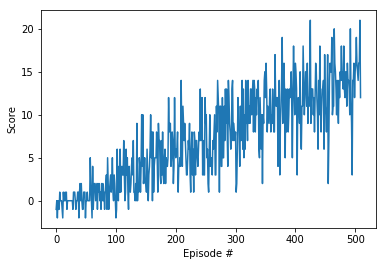

[//]: # (Image References)

[image1]: https://user-images.githubusercontent.com/10624937/42135619-d90f2f28-7d12-11e8-8823-82b970a54d7e.gif "Trained Agent"

# Project 1: Navigation

### Introduction

For this project, you will train an agent to navigate (and collect bananas!) in a large, square world.  The environment is based on [Unity ML-agents](https://github.com/Unity-Technologies/ml-agents)

![Trained Agent][image1]

A reward of +1 is provided for collecting a yellow banana, and a reward of -1 is provided for collecting a blue banana.  Thus, the goal of your agent is to collect as many yellow bananas as possible while avoiding blue bananas.  

The state space has 37 dimensions and contains the agent's velocity, along with ray-based perception of objects around agent's forward direction.  Given this information, the agent has to learn how to best select actions.  Four discrete actions are available, corresponding to:
- **`0`** - move forward.
- **`1`** - move backward.
- **`2`** - turn left.
- **`3`** - turn right.

The task is episodic, and in order to solve the environment, your agent must get an average score of +13 over 100 consecutive episodes.

## Implementation

###  the Deep Q-Networks (DQN)

This project implements the Deep Q-Networks as described in the [Nature publication : "Human-level control through deep reinforcement learning (2015)"](https://storage.googleapis.com/deepmind-media/dqn/DQNNaturePaper.pdf). It includes two major improvements over the naive deep Q-learning algorithm:
 - Experience Replay: "In addition to breaking harmful correlations, experience replay allows us to learn more from individual tuples multiple times, recall rare occurrences, and in general make better use of our experience."
 - Fixed Q Targets: Without fixed Q target, we update a guess with a guess which can potentially lead to harmful correlations.

### The Python Code 

The code implemented for this project is based on the Lunar Lander example in the Deep Reinforcement Learning Nanodegree. The following are the files:

- model.py: In this Python file, the deep Neural Network model is defined. 
- dqn_agent.py:  In this Python file, the DQN agent class and a Replay Buffer memory used by the DQN are defined.
- Navigation.ipynb:  It is the main routine Jupyter notebook file that trains the DQN agent for the banana collecting task.
 

### The DQN Parameters 

The DQN agent has the following parameter values: 

```
BUFFER_SIZE = int(1e5)  # replay buffer size
BATCH_SIZE = 64         # minibatch size 
GAMMA = 0.995           # discount factor 
TAU = 1e-3              # for soft update of target parameters
LR = 5e-4               # learning rate 
UPDATE_EVERY = 4        # how often to update the network
```

The Neural Networks have three fully connected layers:

```
The size of the Input nodes is 37, which is the length of the state. 
A fully Connected Layer (1024 nodes, Relu activation)
A Fully Connected Layer (1024 nodes, Relu activation) 
The size of Ouput nodes is 4, which is the size of the actions.
```

###  The Results
The average score over 100 continuous episodes from the training process is shown below, which shows that the DQN archived the training requirement in 410 episodes.



Here is a plot of the scores over the episodes: 



### Possible Improvements
One way to improve the performance is to train the agent directly from the directly observed raw pixels instead of using the environment's internal states. For this,  the convolutional neural network would be added at the input of the network in order to process the raw pixels values.

The following DQN architectures could also potentially increase the performance:
- [Double DQN](https://arxiv.org/abs/1509.06461), which is demonstrated effective in reducing the verestimate of action values under certain conditions.
- [Prioritized experience replay](https://arxiv.org/abs/1511.05952), which is based on the idea that the agent can learn more effectively from some transitions than from others, and the more important transitions should be sampled with higher probability.
- [Dueling DQN](https://arxiv.org/abs/1511.06581), which replaces the traditional Deep Q-Network architecture with a dueling architecture that can assess the value of each state, without having to learn the effect of each action.